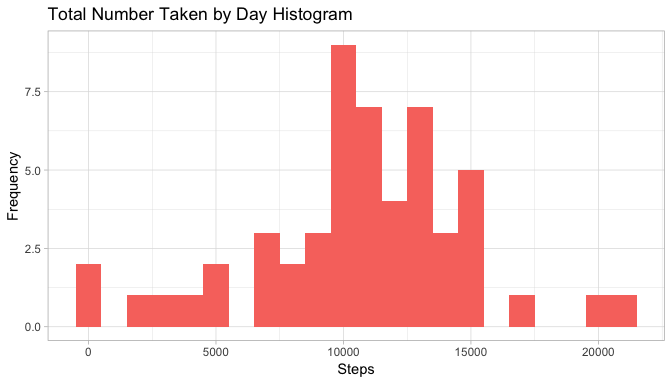

# Introduction

It is now possible to collect a large amount of data about personal movement using activity monitoring devices such as a Fitbit, Nike Fuelband, or Jawbone Up. These type of devices are part of the “quantified self” movement – a group of enthusiasts who take measurements about themselves regularly to improve their health, to find patterns in their behavior, or because they are tech geeks. But these data remain under-utilized both because the raw data are hard to obtain and there is a lack of statistical methods and software for processing and interpreting the data.

This assignment makes use of data from a personal activity monitoring device. This device collects data at 5 minute intervals through out the day. The data consists of two months of data from an anonymous individual collected during the months of October and November, 2012 and include the number of steps taken in 5 minute intervals each day.

The data for this assignment can be downloaded from the course web site:

Dataset: [Activity monitoring data](https://d396qusza40orc.cloudfront.net/repdata%2Fdata%2Factivity.zip) [52K]

The variables included in this dataset are:

- steps: Number of steps taking in a 5-minute interval (missing values are coded as NA)
- date: The date on which the measurement was taken in YYYY-MM-DD format
- interval: Identifier for the 5-minute interval in which measurement was taken

The dataset is stored in a comma-separated-value (CSV) file and there are a total of 17,568 observations in this dataset.

Loading tidyverse

```
## ── Attaching packages ────────────────────────────────────────── tidyverse 1.2.1 ──
```

```
## ✔ ggplot2 3.1.1       ✔ purrr   0.3.2  
## ✔ tibble  2.1.1       ✔ dplyr   0.8.0.1
## ✔ tidyr   0.8.3       ✔ stringr 1.4.0  
## ✔ readr   1.3.1       ✔ forcats 0.4.0
```

```
## ── Conflicts ───────────────────────────────────────────── tidyverse_conflicts() ──
## ✖ dplyr::filter() masks stats::filter()
## ✖ dplyr::lag()    masks stats::lag()
```

Download the dataset to ./data directory and read activity.csv

```r
if(!file.exists("./data")){
  dir.create("./data")}
file_url <- "https://d396qusza40orc.cloudfront.net/repdata/data/activity.zip"
download.file(file_url, destfile="./data/dataset.zip")
unzip("./data/dataset.zip")

activity_data <- read.csv("activity.csv")
```

Preprocess dataset by removing missing values (NA)

```r
complete_data <- complete.cases(activity_data)
complete_activity <- activity_data[complete_data, ]
```

# What is the mean total number of steps taken per day?

Calculate the total number of steps taken per day

```r
total_steps_day <- complete_activity %>% 
  group_by(date) %>% 
  summarize(total_steps = sum(steps))

head(total_steps_day)
```

```
## # A tibble: 6 x 2
##   date       total_steps
##   <fct>            <int>
## 1 2012-10-02         126
## 2 2012-10-03       11352
## 3 2012-10-04       12116
## 4 2012-10-05       13294
## 5 2012-10-06       15420
## 6 2012-10-07       11015
```

Plot histogram for the total steps taken by day

```r
qplot(total_steps_day$total_steps, geom = "histogram", binwidth = 1000, 
      main = "Total Number Taken by Day Histogram", 
      xlab = "Steps", 
      ylab = "Frequency",
      fill = "red", 
      show.legend = FALSE)
```

<!-- -->

Calculate and report the mean and median of the total number of steps taken per day

```r
mean_total_steps_day <- mean(total_steps_day$total_steps)
median_total_steps_day <- median(total_steps_day$total_steps)
```

The mean of the total number of steps per day is 10766.19.
The median of the total number of steps per day is 10765.

# What is the average daily activity pattern?

Make a time series plot (type = "l") of the 5-minute interval (x-axis) and the average number of steps taken, averaged across all days (y-axis)

```r
interval_mean_steps <- complete_activity %>% 
     group_by(interval) %>% 
     summarize(mean_steps = mean(steps))

ggplot(interval_mean_steps, aes(interval, mean_steps)) +
     geom_line(color = "green") +
     labs(title = "Average Daily Steps by Interval", x = "Interval", y = "Average Steps")
```

<!-- -->

Which 5-minute interval, on average across all the days in the dataset, contains the maximum number of steps?

```r
max_interval <- interval_mean_steps[which.max(interval_mean_steps$mean_steps), ]
```

The interval with the maximum number of steps is 835, with 206.17 average steps.

# Imputing missing values

First, let's count the missing value in the original activity dataset

```r
colSums(is.na(activity_data))
```

```
##    steps     date interval 
##     2304        0        0
```

So, only the steps variable has missing values

Imputing the missing values with the 5-minute interval median value using the aggregate function

```r
steps_interval <- aggregate(steps ~ interval, activity_data, median, na.rm = TRUE)
median_steps_interval <- function(interval) {
     steps_interval[steps_interval$interval == interval, ]$steps
}
```

Create new dataset equal to the original data, but with the missing values filled with the corresponding 5-minute interval median

```r
impute_activity <- activity_data
for(i in 1:nrow(impute_activity)) {
     if(is.na(impute_activity[i, ]$steps)) {
          impute_activity[i, ]$steps <- median_steps_interval(impute_activity[i, ]$interval)
     }
}
```

Verifying the missing values are filled

```r
colSums(is.na(impute_activity))
```

```
##    steps     date interval 
##        0        0        0
```

Make a histogram of the total number of steps taken each day with the impute dataset

```r
impute_steps_day <- impute_activity %>% 
     group_by(date) %>% 
     summarize(total_steps = sum(steps, na.rm = TRUE))

qplot(impute_steps_day$total_steps, geom = "histogram", binwidth = 1000, 
      main = "Total Number Taken by Day Histogram (Impute)", 
      xlab = "Steps", 
      ylab = "Frequency",
      fill = "red", 
      show.legend = FALSE)
```

<!-- -->

Calculate mean and median for total steps taken by day (impute)

```r
mean_impute_steps_day <- mean(impute_steps_day$total_steps)
median_impute_steps_day <- median(impute_steps_day$total_steps)
```

The mean (impute) of the total number of steps per day is 9503.87.
The median (impute) of the total number of steps per day is 10395.

Dataset | Mean (steps) | Median (steps)
--- | --- | ---
Original (with NA) | 10766.19 | 10765
Impute (filled NA) | 9503.87 | 10395

Conclusion: Imputing missing values with the corresponding 5-minute interval median lower the mean and median values from the original activity dataset.

# Are there differences in activity patterns between weekdays and weekends?

Create a new factor variable in the dataset with two levels - "weekdays" and "weekend" indicating where a given date is a weekday or weekend

```r
activity_data$date <- as.Date(activity_data$date, format = "%Y-%m-%d")
activity_data <- activity_data %>% 
     mutate(day_week = weekdays(activity_data$date))
activity_data$weekday_weekend <- activity_data$day_week
for(i in 1:nrow(activity_data)) {
     if(activity_data[i, ]$day_week %in% c("Saturday", "Sunday")) {
          activity_data[i, ]$weekday_weekend <- "weekend"
     } 
     else {
          activity_data[i, ]$weekday_weekend <- "weekday"
     }
}

activity_data$weekday_weekend <- as.factor(activity_data$weekday_weekend)
```

Verifying that day_week matches the corresponding factor (weekday or weekend)

```r
count(activity_data, activity_data$day_week, activity_data$weekday_weekend)
```

```
## # A tibble: 7 x 3
##   `activity_data$day_week` `activity_data$weekday_weekend`     n
##   <chr>                    <fct>                           <int>
## 1 Friday                   weekday                          2592
## 2 Monday                   weekday                          2592
## 3 Saturday                 weekend                          2304
## 4 Sunday                   weekend                          2304
## 5 Thursday                 weekday                          2592
## 6 Tuesday                  weekday                          2592
## 7 Wednesday                weekday                          2592
```
 
Create a panel time series plot (type = "l") of the 5-minute interval (x-axis) and the average number of steps taken, averaged across all weekday and weekend days (y-axis)

Removing missing values (NAs)

```r
complete_data <- complete.cases(activity_data)
complete_activity <- activity_data[complete_data, ]
```

Create the panel plot

```r
interval_mean_steps <- complete_activity %>% 
     group_by(interval, weekday_weekend) %>% 
     summarize(mean_steps = mean(steps))

ggplot(interval_mean_steps, aes(interval, mean_steps, color = weekday_weekend)) + 
     geom_line(color = "green") + 
     labs(title = "Average Daily Steps by Week Type", x = "Interval", y = "Average Number of Steps") + 
     facet_wrap(~weekday_weekend, ncol = 1, nrow = 2)
```

<!-- -->

Conclusion: There are differences in the average daily steps by week type shown in the panel plot.
